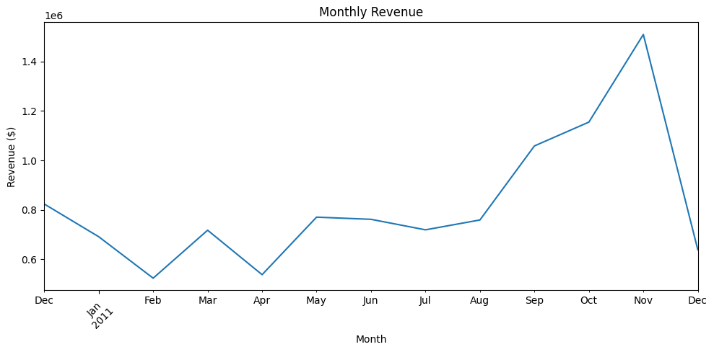
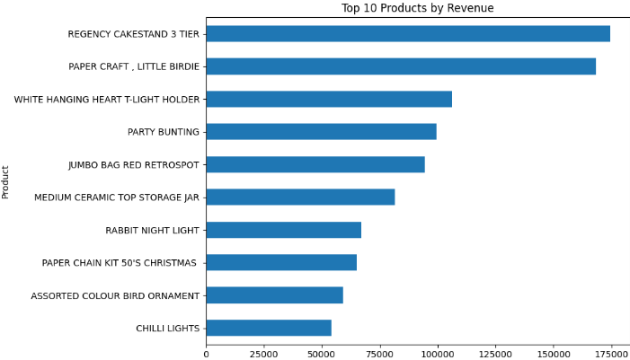
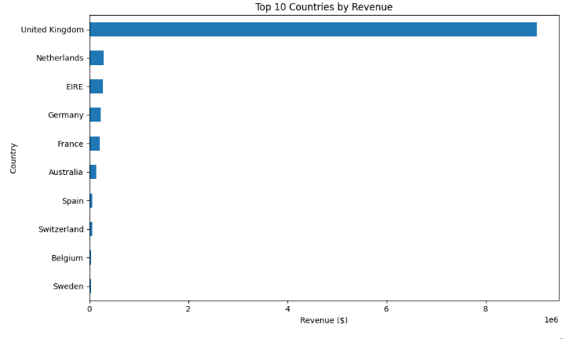

# Online Retail Sales Analysis

## Project Overview

This project analyzes online retail sales using Python to identify revenue trends, top products, and customer markets. The analysis provides business insights and recommendations based on the data.

## Data Cleaning

The dataset was cleaned by removing cancelled transactions and transactions with negative quantities. This resulted in **530,104 clean sales records** from the original **541,909 records**.

## Analysis Questions

- How much revenue did the business generate?
- Which products generated the most revenue?
- Which months had the highest revenue?
- Which countries generated the most revenue?

## Tools Used

- Python
- Pandas
- Matplotlib
- Google Colab
- GitHub

## Key Findings

- Total revenue: **$10,666,684.54**
- Average order value: **$534.40**
- Highest revenue month: **November 2011**
- Largest market: **United Kingdom**
- Top product by revenue: **Regency Cakestand 3 Tier**

## Monthly Revenue

## Top 10 Products by Revenue

## Top 10 Countries by Revenue

## Business Recommendations

- Keep top-performing products well stocked.
- Prepare inventory for the stronger sales period toward the end of the year.
- Explore opportunities to grow sales in international markets.
